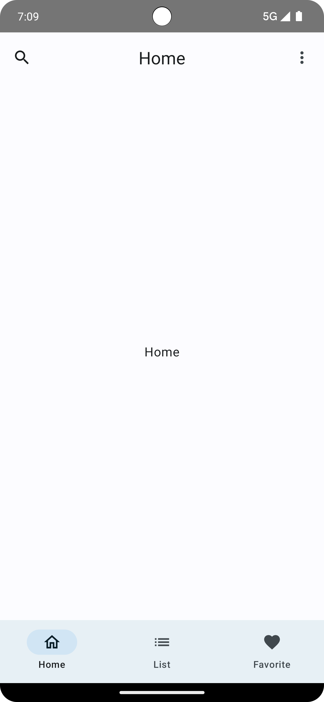
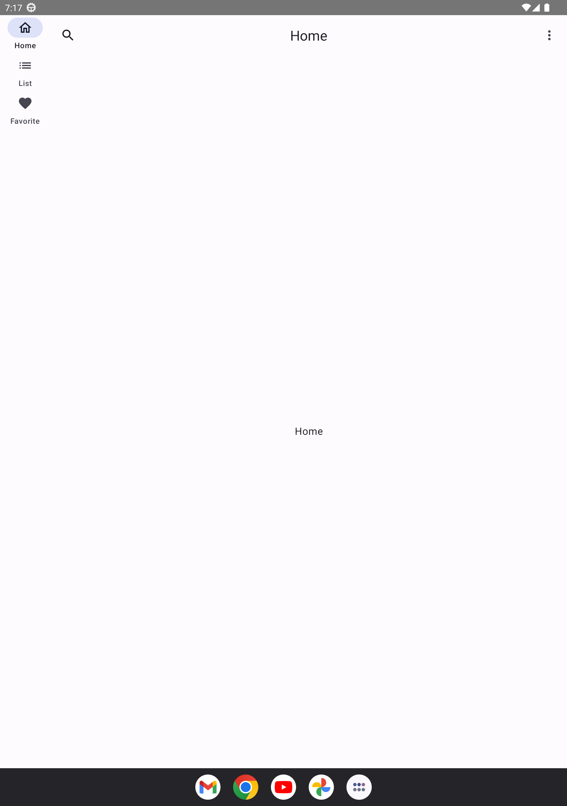
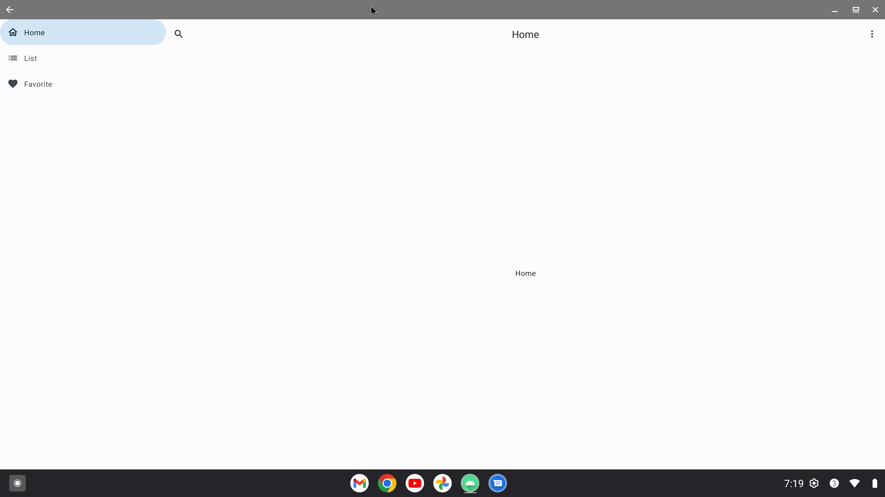

Material 3 Adaptive Navigation Suite Demo App
==================

This app shows how to create a responsive interface using New APIs for adaptive layouts on Jetpack Compose with help of [Material 3 Adaptive Navigation Suit](https://cs.android.com/androidx/platform/frameworks/support/+/androidx-main:compose/material3/material3-adaptive-navigation-suite/androidx-compose-material3-adaptive-navigation-suite-documentation.md).

## Versions
[Material 3 Adaptive Navigation Suit](https://cs.android.com/androidx/platform/frameworks/support/+/androidx-main:compose/material3/material3-adaptive-navigation-suite/androidx-compose-material3-adaptive-navigation-suite-documentation.md) - "1.0.0-alpha01"
[AndroidX Navigation](https://developer.android.com/reference/androidx/navigation/package-summary) - "2.7.5"
[Android Gradle Plugin](https://developer.android.com/reference/tools/gradle-api/8.2/classes) - "8.2.0"
[Kotlin](https://github.com/JetBrains/kotlin/releases/tag/v1.9.20) - "1.9.20"

## Screenshots

# License

**Material 3 Adaptive Navigation Suite Demo** is distributed under the terms of the Apache License (Version 2.0). See the
[license](LICENSE) for more information.